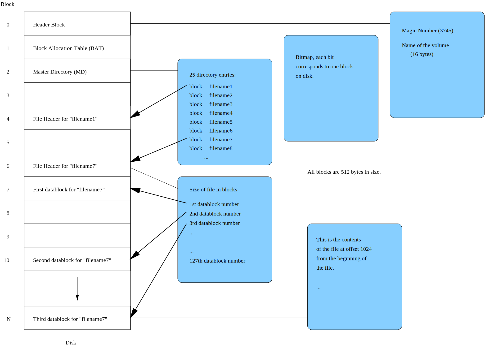

Trivial Filesystem
==================

Trivial File System (TFS) is, as its name implies, a very simple file system.
All operations are implemented in a straightforward manner without much
consideration for efficiency, there is only simple synchronization and no
bookkeeping for open files, etc. The purpose of the TFS is to give students a
working (although not thread-safe) filesystem and a tool (see
:doc:`using-kudos`) for moving data between TFS and the native filesystem of
the platform on which KUDOS is being developed.

When students implement their own filesystem, the idea is that files can be
moved from the native filesystem to the TFS using the TFS tool, and then they
can be moved to the student filesystem using KUDOS itself. This way students
don't necessarily need to write their own tool(s) for the simulator platform.
It is, of course, perfectly acceptable to write your own tool(s).

Trivial filesystem uses the native block size of a drive (must be predefined).
Each filesystem contains a volume header block (block number 0 on disk). After
header block comes block allocation table (BAT, block number 1), which uses one
block. After that comes the master directory block (MD, block number 2), also
using one block. The rest of the disk is reserved for file header (inode) and
data blocks. The following figure illustrates the structure of a TFS volume:

.. _tfs_figure:

     An illustration of the disk blocks on a TFS volume.

Note that all multibyte data in TFS is *big-endian*. This is not a problem in
the MIPS32 version of KUDOS, since YAMS is big-endian also, but in the x86-64
version of KUDOS this is a problem, since x86-64 is little-endian. This means
that we need to go through the function ``from_big_endian32`` (defined in
``kudos/lib/libc.h``) when dealing with TFS.  For x86-64 this function
translates the value into little-endian, for MIPS32 this function does nothing.

The volume header block has the following structure. Other data may be present
after these fields, but it is ignored by TFS.

+----------+----------------------------+-------------+----------------------+
| Offset   | Type                       | Name        | Description          |
+==========+============================+=============+======================+
| ``0x00`` | ``uint32_t``               | ``magic``   | Magic number, must   |
|          |                            |             | be 3745 (``0x0EA1``) |
|          |                            |             | TFS volumes.         |
+----------+----------------------------+-------------+----------------------+
| ``0x04`` | ``char[TFS_VOLNAME_MAX]``  | ``volname`` | Name of the volume,  |
|          |                            |             | including the        |
|          |                            |             | terminating zero     |
+----------+----------------------------+-------------+----------------------+

The block allocation table is a bitmap which records the free and reserved
blocks on the disk, one bit per block, 0 meaning free and 1 reserved. For a
512-byte block size, the allocation table can hold 4096 bits, resulting in a
2MB disk. Note that the allocation table includes also the three first blocks,
which are always reserved.

The master directory consists of a single disk block, containing a table of the
following 20-byte entries. This means that a disk with a 512-byte block size
can have at most 25 files (512/20 = 25.6).

+-----------+----------------------------+------------+-------------------------+
| Offset    | Type                       | Name       | Description             |
+===========+============================+============+=========================+
| ``0x00``  | ``uint32_t``               | ``inode``  | Number of the disk      |
|           |                            |            | block containing the    |
|           |                            |            | file header (inode) of  |
|           |                            |            | this file.              |
+-----------+----------------------------+------------+-------------------------+
| ``0x04``  | ``char[TFS_FILENAME_MAX]`` | ``name``   | Name of the file,       |
|           |                            |            | including the           |
|           |                            |            | terminating zero.       |
+-----------+----------------------------+------------+-------------------------+

This means that the maximum file name length is actually
``TFS_FILENAME_MAX-1``.

A file header block ("inode") describes the location of the file on the disk
and its actual size.  The contents of the file is stored to the allocated
blocks in the order they appear in the block list (the first ``TFS_BLOCK_SIZE``
bytes are stored to the first block in the list etc.). A file header block has
the following structure:

+----------+------------------------------+--------------+----------------------------------------------+
| Offset   | Type                         | Name         | Description                                  |
+==========+==============================+==============+==============================================+
| ``0x00`` | ``uint32_t``                 | ``filesize`` | Size of the file in bytes. When compiling    |
|          |                              |              | for x86-64 this field is big-endian so the   |
|          |                              |              | conversion function is used on this field.   |
+----------+------------------------------+--------------+----------------------------------------------+
| ``0x04`` | ``uint32_t[TFS_BLOCKS_MAX]`` | ``block``    | Blocks allocated for this file. Unused       |
|          |                              |              | blocks are marked as 0 as a precaution       |
|          |                              |              | (since block 0 can never be a part of any    |
|          |                              |              | file). When compiling for x86-64 this field  |
|          |                              |              | is big-endian so the conversion function is  |
|          |                              |              | used on this field.                          |
+----------+------------------------------+--------------+----------------------------------------------+

With a 512-byte block size, the maximum size of a file is limited to 127 blocks
(512/4 − 1) or 65024 bytes.

Note that this specification does not restrict the block size of the device on
which a TFS can reside. However, the KUDOS TFS implementation and the TFS tool
do not support block sizes other than 512 bytes. Note also that even though the
TFS filesystem size is limited to 2MB, the device (disk image) on which it
resides can be larger, the remaining part is just not used by the TFS.

TFS Driver Module
-----------------

The KUDOS TFS module implements the Virtual File System interface with the
following functions.

``fs_t * tfs_init(gbd t *disk, uint32_t sector)``
  * Attempts to initialize a TFS on the given disk (a generic block device,
    actually) at the given sector sector. If the initialization succeeds, a
    pointer to the initialized filesystem structure is returned. If not
    (e.g. the header block does not contain the right magic number or the
    block size is wrong), ``NULL`` is returned.
  * Implementation:

    1. Check that the block size of the disk is supported by TFS.
    2. Allocate semaphore for filesystem locking (``tfs->lock``).
    3. Allocate a memory page for TFS internal buffers and data and the
       filesystem structure (``fs_t``).
    4. Read the first block of the disk and check the magic number.
    5. Initialize the TFS internal data structures.
    6. Store disk and the filesystem locking semaphore to the internal data
       structure.
    7. Copy the volume name from the read block into ``fs_t``.
    8. Set ``fs_t`` function pointers to TFS functions.
    9. Return a pointer to the ``fs_t``.

``int tfs_unmount (fs_t *fs)``
  * Unmounts the filesystem. Ensures that the filesystem is in a "clean" state
    upon exit, and that future operations will fail with ``VFS_NO_SUCH_FS``.
  * Implementation:

    1. Wait for active operation to finish by calling ``semaphore_P`` on
       ``tfs->lock``.
    2. Deallocate the filesystem semaphore ``tfs->lock``.
    3. Free the memory page allocated by ``tfs_init``.

``int tfs_open(fs_t *fs, char *filename)``
  * Opens a file for reading and writing. TFS does not keep any status
    regarding open files, the returned file handle is simply the inode
    block number of the file.
  * Implementation:

    1. Lock the filesystem by calling ``semaphore_P`` on ``tfs->lock``.
    2. Read the MD block.
    3. Search the MD for filename.
    4. Free the filesystem by calling ``semaphore_V`` on ``tfs->lock``.
    5. If filename was found the MD, return its inode block number,
       otherwise return ``VFS_NOT_FOUND``.

``int tfs_close(fs_t *fs, int fileid)``
  Does nothing, since TFS does not keep status for open files.

``int tfs_create(fs_t *fs, char *filename, int size)``
  * Creates a file with the given name and size (TFS files cannot be resized
    after creation).
  * The file will contain all zeros after creation.
  * Implementation:

    1. Lock the filesystem by calling ``semaphore_P`` on ``tfs->lock``.
    2. Check that the size of the file is not larger than the maximum file size
       that TFS can handle.
    3. Read the MD block.
    4. Check that the MD does not contain ``filename``.
    5. Find an empty slot in the MD, return error if the directory is full.
    6. Add a new entry to the MD.
    7. Read the BAT block.
    8. Allocate the inode and file blocks from BAT, and write the block numbers and the
       filesize to the inode in memory.
    9. Write the BAT to disk.
    10. Write the MD to disk.
    11. Write the inode to the disk.
    12. Zero the content blocks of the file on disk.
    13. Free the filesystem by calling ``semaphore_V`` on ``tfs->lock``.
    14. Return ``VFS_OK``.

``int tfs_remove(fs_t *fs, char *filename)``
  * Removes the given file from the directory and frees the blocks allocated
    for it.
  * Implementation:

    1. Lock the filesystem by calling ``semaphore_P`` on ``tfs->lock``.
    2. Read the MD block.
    3. Search the MD for ``filename``, return error if not found.
    4. Read the BAT block.
    5. Read inode block.
    6. Free inode block and all blocks listed in the inode from the BAT.
    7. Clear the MD entry (set inode to 0 and name to an empty string).
    8. Write the BAT to the disk.
    9. Write the MD to disk.
    10. Free the filesystem by calling ``semaphore_V`` on ``tfs->lock``.
    11. Return ``VFS_OK``.

``int tfs_read (fs_t *fs, int fileid, void *buffer, int bufsize, int offset)``
  * Reads at most ``bufsize`` bytes from the given file into the given buffer.
    The number of bytes read is returned, or a negative value on error. The
    data is read starting from given offset.  If the offset equals the file
    size, the return value will be zero.
  * Implementation:

    1. Lock the filesystem by calling ``semaphore_P`` on ``tfs->lock``.
    2. Check that ``fileid`` is sane (≥ 3 and not beyond the end of the
       device/filesystem).
    3. Read the inode block (which is ``fileid``).
    4. Check that the ``offset`` is valid (not beyond end of file).
    5. For each needed block do the following:

       a. Read the block.
       b. Copy the appropriate part of the block into the right place in
          buffer.
    6. Free the filesystem by calling ``semaphore_V`` on ``tfs->lock``.
    7. Return the number of bytes *actually* read.

``int tfs_write(fs_t *fs, int fileid, void *buffer, int datasize, int offset)``
  * Writes (at most) ``datasize`` bytes to the given file. The number of bytes
    actually written is returned. Since TFS does not support file resizing, it
    may often be the case that not all bytes are written (which should actually
    be treated as an error condition). The data is written starting from the
    given offset.
  * Implementation:

    1. Lock the filesystem by calling ``semaphore_P`` on ``tfs->lock``.
    2. Check that ``fileid`` is sane (≥ 3 and not beyond the end of the
       device/filesystem).
    3. Read the inode block (which is ``fileid``).
    4. Check that the ``offset`` is valid (not beyond end of file).
    5. For each needed block do the following:

       a. If only part of the block will be written, read the block.
       b. Copy the appropriate part of the block from the right place in
          buffer.
       c. Write the block.
    6. Free the filesystem by calling ``semaphore_V`` on ``tfs->lock``.
    7. Return the number of bytes *actually* written.

``int tfs_getfree(fs_t *fs)``
  * Returns the number of free bytes on the filesystem volume.
  * Implementation:

    1. Lock the filesystem by calling ``semaphore_P`` on ``tfs->lock``.
    2. Read the BAT block.
    3. Count the number of zeroes in the bitmap. If the disk is smaller than
       the maximum supported by TFS, only the first appropriate number of bits
       are examined (of course).
    4. Get number of free bytes by multiplying the number of free blocks by
       block size.
    5. Free the filesystem by calling ``semaphore_V`` on ``tfs->lock``.
    6. Return the number of free bytes.
